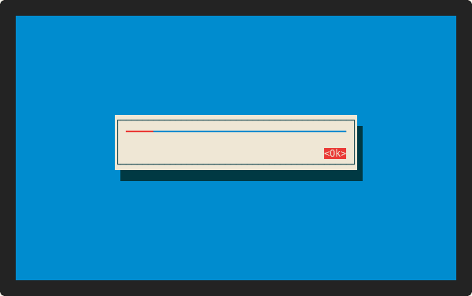
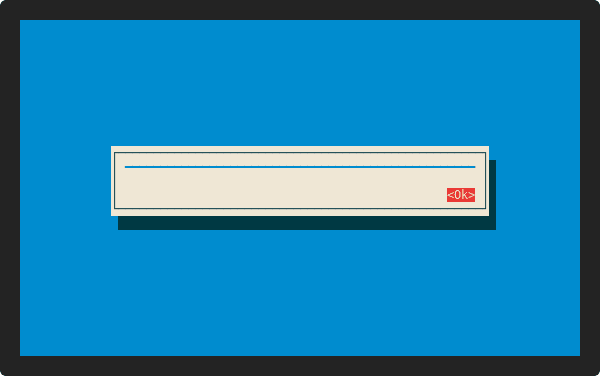

<h1 align="center">Welcome to cursive-async-view 👋</h1>
<p align="center">
  <a href="https://travis-ci.org/deinstapel/cursive-async-view">
    
  </a>
  <a href="https://travis-ci.org/deinstapel/cursive-async-view">
    
  </a>
  <a href="https://crates.io/crates/cursive-async-view">
    
  </a>
  <a href="https://docs.rs/cursive-async-view">
    
  </a>
  <a href="https://github.com/deinstapel/cursive-async-view/blob/master/LICENSE">
    
  </a>
  <a href="http://spacemacs.org">
    
  </a>
  <a href="http://makeapullrequest.com">
    
  </a>
  <br>
  <i>A loading-screen wrapper for
  <a href="https://github.com/gyscos/cursive">gyscos/cursive</a>
  views</i>
</p>

---

This project provides a wrapper view with a loading screen for [gyscos/cursive](https://github.com/gyscos/cursive) views. The loading screen will disappear once the wrapped view is fully loaded. This is useful for displaying views which may take long to construct or depend on e.g. the network.

## How does it look like? `demo` [](https://github.com/faressoft/terminalizer)

<details>
  <summary>Expand to view</summary>
  
  
  
  
</details>

## Usage

Simply add to your `Cargo.toml`

```toml
[dependencies]
cursive-async-view = "^0"
```

### Asynchronous view loading without progress information

If you can't tell the progress during a long taking preparation of data for
a view, you may wrap the creation of this view in an `AsyncView`. This will
display a loading animation until the inner view is ready to be drawn.

```rust
use std::time::{Instant, Duration};
use cursive::{views::TextView, Cursive, CursiveExt};
use cursive_async_view::{AsyncView, AsyncState};

let mut siv = Cursive::default();
let instant = Instant::now();
let async_view = AsyncView::new(&mut siv, move || {
    if instant.elapsed() > Duration::from_secs(10) {
        AsyncState::Available(
            TextView::new("Yay!\n\nThe content has loaded!")
        )
    } else {
        AsyncState::Pending
    }
});

siv.add_layer(async_view);
// siv.run();
```

Refer to the `AsyncView` struct level documentation for a detailed
explanation or to the `simple` example located in the source code
repository.

If you need to do a blocking operation during the construction of the child
view, you may have a look at the alternate `new_with_bg_task` constructor.

```rust
use std::thread;
use std::time::Duration;

use cursive::views::TextView;
use cursive::{Cursive, CursiveExt};
use cursive_async_view::AsyncView;

let mut siv = Cursive::default();
let async_view = AsyncView::new_with_bg_creator(&mut siv, move || {
    // this function is executed in a background thread, so we can block
    // here as long as we like
    thread::sleep(Duration::from_secs(10));

    // enough blocking, let's show the content
    Ok("Yeet! It worked 🖖")
}, TextView::new); // create a text view from the string

siv.add_layer(async_view);
// siv.run();
```

Refer to the `AsyncView` struct level documentation for a detailed
explanation or to the `bg_task` example located in the source code
repository.

### Asynchronous view loading with a progress bar

If you have information about the progress a long taking view creation has made,
you can wrap the creation in an `AsyncProgressView`. This will display a progress
bar until the inner view is ready to be drawn.

```rust
use cursive::{views::TextView, Cursive, CursiveExt};
use cursive_async_view::{AsyncProgressView, AsyncProgressState};

let mut siv = Cursive::default();
let start = std::time::Instant::now();
let async_view = AsyncProgressView::new(&mut siv, move || {
    if start.elapsed().as_secs() < 3 {
        AsyncProgressState::Pending(start.elapsed().as_secs() as f32 / 3f32)
    } else {
        AsyncProgressState::Available(TextView::new("Finally it loaded!"))
    }
});

siv.add_layer(async_view);
// siv.run();
```

## Changelog

The changelog is located in a [separate file](./CHANGELOG.md) and contains changes and migration hints for upcoming versions.

## Troubleshooting

If you find any bugs/unexpected behaviour or you have a proposition for future changes open an issue describing the current behaviour and what you expected.

## Development [](https://travis-ci.org/deinstapel/cursive-async-view)

> TBD

### Running the tests

Just run

```plain
$ cargo test
```

to execute all available tests.

#### shields.io endpoints

[shields.io](https://shields.io) endpoints are generated inside the `./target/shields` folder. They are used in this README.

## Authors

**Fin Christensen**

> [:octocat: `@fin-ger`](https://github.com/fin-ger)  
> [:elephant: `@fin_ger@weirder.earth`](https://weirder.earth/@fin_ger)  
> [:bird: `@fin_ger_github`](https://twitter.com/fin_ger_github)  

<br>

**Johannes Wünsche**

> [:octocat: `@jwuensche`](https://github.com/jwuensche)  
> [:elephant: `@fredowald@mastodon.social`](https://mastodon.social/web/accounts/843376)  
> [:bird: `@Fredowald`](https://twitter.com/fredowald)  

## Show your support

Give a :star: if this project helped you!
